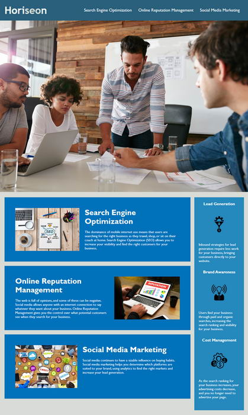

# Horiseon - Marketing agency Website
Marketing agency Website Code refactoring to an existing site to make codebase that follows accessibility standards and is optimized for search engines.
## Installation
Website can be accessed at [www.rovel.ca/horiseon](http://www.rovel.ca/horiseon)
## Usage ##
Read and access links on one main page   

## The Repository
This repository is available at [github.com/elogonme/horiseon](https://github.com/elogonme/horiseon)
## Credits
Refactored by Eldar Humbatov [github.com/elogonme](https://github.com/elogonme)
## License
This source code is available to everyone under the standard [MIT license](LICENSE.md) 